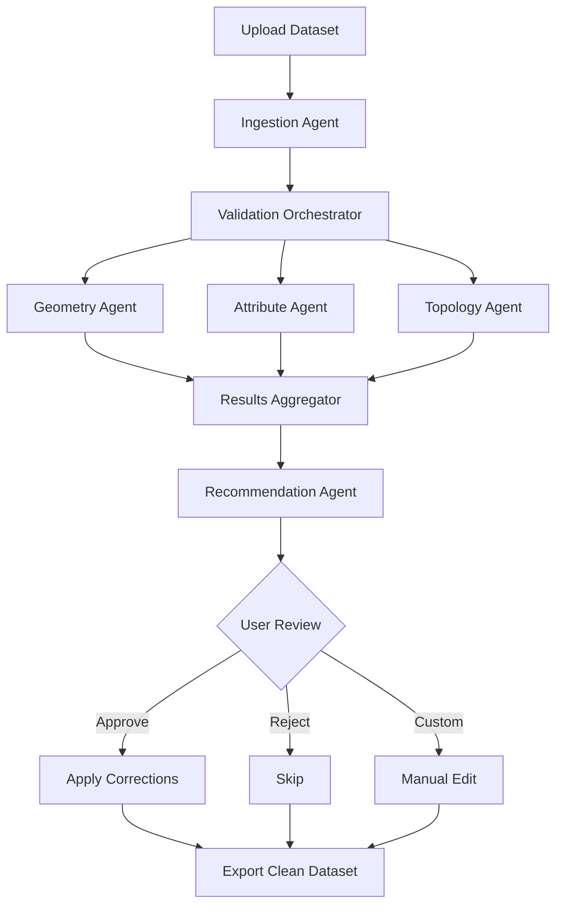

# GeoSpatial Data Quality Agent 🗺️🤖

An intelligent, semi-autonomous system that automates the detection, analysis, and correction of quality issues in geospatial datasets using multi-agent AI architecture.

[](https://www.python.org/downloads/)
[](https://reactjs.org/)
[](https://github.com/langchain-ai/langgraph)
[](https://developers.arcgis.com/)
[](LICENSE)

---

## 📋 Table of Contents

- [Overview](#overview)
- [Problem Statement](#problem-statement)
- [Key Features](#key-features)
- [System Architecture](#system-architecture)
- [Tech Stack](#tech-stack)
- [Prerequisites](#prerequisites)
- [Installation](#installation)
- [Configuration](#configuration)
- [Usage](#usage)
- [Project Structure](#project-structure)
- [Agent Workflow](#agent-workflow)
- [API Documentation](#api-documentation)
- [Testing](#testing)
- [Datasets](#datasets)
- [Evaluation Metrics](#evaluation-metrics)
- [Roadmap](#roadmap)
- [Contributing](#contributing)
- [License](#license)
- [Acknowledgments](#acknowledgments)
- [Contact](#contact)

---

## 🎯 Overview

**GeoSpatial Data Quality Agent** is a master's thesis project that addresses the critical challenge of geospatial data quality validation. GIS professionals spend 60-80% of their time cleaning data—this tool automates detection and suggests intelligent corrections using AI-powered agents.

### 🎥 Demo

> [Link to demo video will be added]


*Interactive validation dashboard built with ESRI Calcite Design System*

---

## ❓ Problem Statement

Geospatial datasets frequently contain quality issues that impede analysis:

- **Geometry Errors**: Invalid polygons, self-intersections, null geometries
- **Attribute Inconsistencies**: Typos, naming variations, missing values
- **Topology Violations**: Gaps, overlaps, disconnected networks
- **Metadata Issues**: Missing CRS, incomplete documentation

**Current Solutions:**
- Manual inspection (time-consuming, error-prone)
- Rule-based validators (inflexible, limited coverage)
- Expensive commercial tools (cost-prohibitive for many users)

**Our Solution:**
An intelligent agent system that combines traditional GIS validation with AI-powered reasoning to automate detection and provide context-aware correction suggestions.

---

## ✨ Key Features

### 🔍 **Multi-Dimensional Validation**
- **Geometry Validation**: Detects invalid geometries, self-intersections, topology errors
- **Attribute Analysis**: Identifies inconsistencies, outliers, missing values using LLM
- **Topology Checking**: Validates spatial relationships (gaps, overlaps, connectivity)
- **Metadata Assessment**: Verifies CRS, completeness, documentation

### 🤖 **Agentic AI Workflow**
- **LangGraph Orchestration**: Multi-agent system with specialized validators
- **Context-Aware Suggestions**: GPT-4 powered intelligent correction recommendations
- **Explainable AI**: Natural language explanations for each issue and suggested fix
- **Human-in-the-Loop**: Interactive review and approval workflow

### 🎨 **Professional UI/UX**
- **Interactive Map**: Visualize problematic features with ArcGIS JavaScript API
- **ESRI Calcite Components**: Production-ready, accessible design system
- **Real-time Updates**: Live validation status and progress tracking
- **Comprehensive Reports**: Downloadable quality assessment documents

### 📊 **Support for Multiple Formats**
- Shapefile (.shp)
- GeoJSON (.geojson)
- KML/KMZ (.kml)
- CSV with coordinates

---

## 🏗️ System Architecture

```
┌─────────────────────────────────────────────────────────────┐
│                     Frontend (React)                        │
│  ┌──────────────┐  ┌──────────────┐  ┌─────────────────┐  │
│  │  Map Viewer  │  │ Issues Panel │  │ Review Dashboard│  │
│  │  (ArcGIS JS) │  │  (Calcite)   │  │    (Calcite)    │  │
│  └──────────────┘  └──────────────┘  └─────────────────┘  │
└────────────────────────┬────────────────────────────────────┘
                         │ REST API
┌────────────────────────▼────────────────────────────────────┐
│                   Backend (FastAPI)                         │
│  ┌──────────────────────────────────────────────────────┐  │
│  │           LangGraph Agent Orchestrator               │  │
│  │  ┌─────────────┐  ┌─────────────┐  ┌─────────────┐  │  │
│  │  │  Geometry   │  │  Attribute  │  │  Topology   │  │  │
│  │  │   Agent     │  │    Agent    │  │    Agent    │  │  │
│  │  └─────────────┘  └─────────────┘  └─────────────┘  │  │
│  │           ▲              ▲              ▲            │  │
│  │           └──────────────┴──────────────┘            │  │
│  │                 Shared State                         │  │
│  └──────────────────────────────────────────────────────┘  │
│                                                             │
│  ┌──────────────┐  ┌──────────────┐  ┌─────────────────┐  │
│  │  ArcGIS API  │  │  OpenAI API  │  │  GeoPandas     │  │
│  │  (Geometry)  │  │  (GPT-4)     │  │  (Analysis)     │  │
│  └──────────────┘  └──────────────┘  └─────────────────┘  │
└─────────────────────────────────────────────────────────────┘
```

### Agent Workflow State Machine



---

## 🛠️ Tech Stack

### **Frontend**
| Technology | Purpose | Version |
|------------|---------|---------|
| React | UI Framework | 18.2+ |
| TypeScript | Type Safety | 5.0+ |
| @esri/calcite-components-react | UI Components | Latest |
| @arcgis/core | Map Visualization | 4.28+ |
| Vite | Build Tool | 5.0+ |
| TailwindCSS | Utility Styling | 3.3+ |

### **Backend**
| Technology | Purpose | Version |
|------------|---------|---------|
| Python | Core Language | 3.11+ |
| FastAPI | Web Framework | 0.104+ |
| LangGraph | Agent Orchestration | Latest |
| LangChain | LLM Integration | 0.1+ |
| ArcGIS API for Python | GIS Operations | 2.3+ |
| GeoPandas | Spatial Analysis | 0.14+ |
| Shapely | Geometry Operations | 2.0+ |

### **AI & ML**
| Technology | Purpose |
|------------|---------|
| OpenAI GPT-4 | Intelligent Suggestions |
| LangGraph | Multi-Agent Workflow |
| LangChain | Tool Orchestration |

### **Data Storage**
- **Development**: File system (uploads, outputs)
- **Optional**: PostgreSQL + PostGIS for advanced queries

---

## 📦 Prerequisites

### **Required**
- Python 3.11 or higher
- Node.js 18+ and npm/yarn
- Git

### **API Keys**
- OpenAI API key ([Get one here](https://platform.openai.com/api-keys))
- ArcGIS Developer account ([Sign up free](https://developers.arcgis.com/sign-up/))

### **Optional**
- Docker & Docker Compose (for containerized deployment)
- PostgreSQL 15+ with PostGIS extension

---

## 🚀 Installation

### **1. Clone the Repository**

```bash
git clone https://github.com/yourusername/geospatial-data-quality-agent.git
cd geospatial-data-quality-agent
```

### **2. Backend Setup**

```bash
# Navigate to backend directory
cd backend

# Create virtual environment
python -m venv venv

# Activate virtual environment
# On Windows:
venv\Scripts\activate
# On macOS/Linux:
source venv/bin/activate

# Install dependencies
pip install -r requirements.txt

# Install GDAL (required for geospatial operations)
# On macOS:
brew install gdal
# On Ubuntu/Debian:
sudo apt-get install gdal-bin libgdal-dev
# On Windows:
# Download from https://www.gisinternals.com/
```

### **3. Frontend Setup**

```bash
# Navigate to frontend directory
cd ../frontend

# Install dependencies
npm install
# or
yarn install
```

### **4. Environment Configuration**

Create `.env` files in both backend and frontend directories:

**Backend (`backend/.env`):**
```env
# OpenAI Configuration
OPENAI_API_KEY=your_openai_api_key_here
OPENAI_MODEL=gpt-4

# ArcGIS Configuration
ARCGIS_API_KEY=your_arcgis_api_key_here

# Server Configuration
HOST=0.0.0.0
PORT=8000
DEBUG=True

# CORS Settings
ALLOWED_ORIGINS=http://localhost:5173,http://localhost:3000

# File Upload Settings
MAX_UPLOAD_SIZE_MB=50
UPLOAD_DIR=./uploads
OUTPUT_DIR=./outputs

# Agent Configuration
MAX_CONCURRENT_AGENTS=3
VALIDATION_TIMEOUT_SECONDS=300
```

**Frontend (`frontend/.env`):**
```env
VITE_API_BASE_URL=http://localhost:8000
VITE_ARCGIS_API_KEY=your_arcgis_api_key_here
VITE_MAP_CENTER_LAT=37.7749
VITE_MAP_CENTER_LNG=-122.4194
VITE_MAP_ZOOM_LEVEL=10
```

---

## ⚙️ Configuration

### **ArcGIS API Key Setup**

1. Go to [ArcGIS Developers](https://developers.arcgis.com/)
2. Sign in or create a free account
3. Navigate to Dashboard → API Keys
4. Create a new API key with these scopes:
   - Basemaps
   - Geocoding
   - Routing (optional)
   - Spatial Analysis

### **OpenAI API Setup**

1. Visit [OpenAI Platform](https://platform.openai.com/)
2. Create an account or sign in
3. Go to API Keys section
4. Generate a new secret key
5. Set usage limits (recommended: $10/month for development)

**Cost Estimate:**
- ~$0.01 - $0.05 per validation run (depending on dataset size)
- Average thesis project: $5-20 total

---

## 💻 Usage

### **Development Mode**

**Terminal 1 - Backend:**
```bash
cd backend
source venv/bin/activate  # or venv\Scripts\activate on Windows
uvicorn main:app --reload --host 0.0.0.0 --port 8000
```

**Terminal 2 - Frontend:**
```bash
cd frontend
npm run dev
# or
yarn dev
```

Access the application at: `http://localhost:5173`

### **Production Mode**

```bash
# Build frontend
cd frontend
npm run build

# Serve with backend
cd ../backend
uvicorn main:app --host 0.0.0.0 --port 8000
```

### **Docker Deployment**

```bash
# Build and run with Docker Compose
docker-compose up --build

# Access at http://localhost:3000
```

---

## 📂 Project Structure

```
geospatial-data-quality-agent/
├── backend/
│   ├── agents/
│   │   ├── __init__.py
│   │   ├── geometry_agent.py      # Geometry validation logic
│   │   ├── attribute_agent.py     # Attribute consistency checks
│   │   ├── topology_agent.py      # Topology validation
│   │   ├── recommendation_agent.py # AI-powered suggestions
│   │   └── orchestrator.py        # LangGraph workflow
│   ├── api/
│   │   ├── __init__.py
│   │   ├── routes.py              # FastAPI endpoints
│   │   └── models.py              # Pydantic schemas
│   ├── core/
│   │   ├── __init__.py
│   │   ├── config.py              # Configuration management
│   │   ├── validation.py          # Core validation logic
│   │   └── utils.py               # Helper functions
│   ├── services/
│   │   ├── __init__.py
│   │   ├── file_handler.py        # File I/O operations
│   │   ├── arcgis_service.py      # ArcGIS API integration
│   │   └── llm_service.py         # OpenAI integration
│   ├── tests/
│   │   ├── test_agents.py
│   │   ├── test_validation.py
│   │   └── test_api.py
│   ├── uploads/                   # Temporary upload storage
│   ├── outputs/                   # Processed datasets
│   ├── main.py                    # FastAPI application entry
│   ├── requirements.txt
│   └── .env
│
├── frontend/
│   ├── public/
│   ├── src/
│   │   ├── components/
│   │   │   ├── Map/
│   │   │   │   ├── MapViewer.tsx
│   │   │   │   └── FeatureHighlight.tsx
│   │   │   ├── Dashboard/
│   │   │   │   ├── IssuesPanel.tsx
│   │   │   │   ├── DetailView.tsx
│   │   │   │   └── SummaryStats.tsx
│   │   │   ├── Upload/
│   │   │   │   └── FileUploader.tsx
│   │   │   └── Report/
│   │   │       └── QualityReport.tsx
│   │   ├── services/
│   │   │   ├── api.ts             # Backend API client
│   │   │   └── mapService.ts      # ArcGIS map utilities
│   │   ├── hooks/
│   │   │   ├── useValidation.ts
│   │   │   └── useMap.ts
│   │   ├── types/
│   │   │   └── index.ts           # TypeScript interfaces
│   │   ├── utils/
│   │   │   └── formatters.ts
│   │   ├── App.tsx
│   │   ├── main.tsx
│   │   └── vite-env.d.ts
│   ├── package.json
│   ├── tsconfig.json
│   ├── vite.config.ts
│   └── .env
│
├── docs/
│   ├── images/                    # Screenshots, diagrams
│   ├── api/                       # API documentation
│   ├── user-guide.md              # User manual
│   ├── developer-guide.md         # Development guide
│   └── evaluation.md              # Evaluation methodology
│
├── datasets/
│   ├── test/                      # Test datasets
│   └── examples/                  # Sample data
│
├── scripts/
│   ├── setup.sh                   # Setup automation
│   ├── seed_data.py               # Generate test data
│   └── run_evaluation.py          # Evaluation script
│
├── docker-compose.yml
├── Dockerfile.backend
├── Dockerfile.frontend
├── .gitignore
├── LICENSE
└── README.md
```

---

## 🔄 Agent Workflow

### **Validation Pipeline**

```python
# Simplified workflow example
from langgraph.graph import StateGraph

# Define validation state
class ValidationState(TypedDict):
    dataset: Any
    issues: List[Issue]
    corrections: List[Correction]
    user_approvals: List[bool]

# Build agent graph
workflow = StateGraph(ValidationState)

# Add agent nodes
workflow.add_node("geometry_validation", GeometryAgent.validate)
workflow.add_node("attribute_validation", AttributeAgent.validate)
workflow.add_node("topology_validation", TopologyAgent.validate)
workflow.add_node("generate_recommendations", RecommendationAgent.suggest)
workflow.add_node("apply_corrections", CorrectionAgent.apply)

# Define workflow edges
workflow.set_entry_point("geometry_validation")
workflow.add_edge("geometry_validation", "attribute_validation")
workflow.add_edge("attribute_validation", "topology_validation")
workflow.add_edge("topology_validation", "generate_recommendations")

# Conditional routing based on severity
workflow.add_conditional_edges(
    "generate_recommendations",
    route_by_severity,
    {
        "critical": "apply_corrections",
        "review": END
    }
)

# Compile and run
app = workflow.compile()
result = app.invoke(initial_state)
```

### **Agent Responsibilities**

| Agent | Input | Output | Tools Used |
|-------|-------|--------|------------|
| **Geometry Agent** | Feature geometries | Invalid geometry list | ArcGIS API, Shapely |
| **Attribute Agent** | Feature attributes | Inconsistency report | GPT-4, pandas |
| **Topology Agent** | Spatial relationships | Topology violations | GeoPandas, ArcGIS |
| **Recommendation Agent** | All issues | Correction suggestions | GPT-4, domain knowledge |

---

## 📡 API Documentation

### **Base URL**
```
http://localhost:8000/api/v1
```

### **Endpoints**

#### **1. Upload Dataset**
```http
POST /upload
Content-Type: multipart/form-data

Parameters:
- file: File (Shapefile, GeoJSON, KML)

Response: 200 OK
{
  "dataset_id": "uuid-string",
  "filename": "parks.shp",
  "feature_count": 1234,
  "geometry_type": "Polygon",
  "crs": "EPSG:4326",
  "bounds": [minX, minY, maxX, maxY]
}
```

#### **2. Start Validation**
```http
POST /validate/{dataset_id}

Response: 202 Accepted
{
  "task_id": "uuid-string",
  "status": "processing",
  "estimated_time": 120
}
```

#### **3. Get Validation Status**
```http
GET /validate/{task_id}/status

Response: 200 OK
{
  "status": "completed",
  "progress": 100,
  "issues_found": 45,
  "processing_time": 98.5
}
```

#### **4. Get Results**
```http
GET /validate/{task_id}/results

Response: 200 OK
{
  "summary": {
    "total_features": 1234,
    "issues_found": 45,
    "critical": 12,
    "warning": 33
  },
  "issues": [
    {
      "id": "issue-1",
      "feature_id": 12345,
      "type": "geometry",
      "severity": "critical",
      "description": "Self-intersection detected",
      "location": [lng, lat],
      "suggested_fix": {
        "method": "buffer(0)",
        "confidence": 0.95,
        "explanation": "Apply zero-distance buffer to resolve..."
      }
    }
  ]
}
```

#### **5. Apply Corrections**
```http
POST /corrections/apply
Content-Type: application/json

Body:
{
  "task_id": "uuid-string",
  "corrections": [
    {
      "issue_id": "issue-1",
      "action": "approve"
    }
  ]
}

Response: 200 OK
{
  "applied": 12,
  "skipped": 3,
  "download_url": "/download/cleaned_dataset.zip"
}
```

[Full API documentation](docs/api/README.md)

---

## 🧪 Testing

### **Run All Tests**

```bash
# Backend tests
cd backend
pytest tests/ -v --cov=agents --cov=core

# Frontend tests
cd frontend
npm run test
# or
yarn test
```

### **Test Coverage**

```bash
# Generate coverage report
pytest --cov=. --cov-report=html

# View report
open htmlcov/index.html
```

### **Test Datasets**

Located in `datasets/test/`:
- `test_geometry_errors.shp` - Known geometry issues
- `test_attribute_errors.geojson` - Attribute inconsistencies
- `test_topology_errors.shp` - Topology violations

---

## 📊 Datasets

### **Included Test Data**

1. **Urban Parks** - Polygon features with attribute variations
2. **Road Network** - Line features with connectivity issues
3. **Point of Interest** - Point features with coordinate errors

### **External Data Sources (Free)**

| Source | Data Type | URL |
|--------|-----------|-----|
| ArcGIS Living Atlas | Various | [link](https://livingatlas.arcgis.com/) |
| OpenStreetMap | All types | [link](https://www.openstreetmap.org/) |
| Natural Earth | Boundaries | [link](https://www.naturalearthdata.com/) |
| US Census TIGER | Roads, boundaries | [link](https://www.census.gov/geographies/mapping-files/time-series/geo/tiger-line-file.html) |

---

## 📈 Evaluation Metrics

### **Validation Accuracy**
- **Precision**: % of flagged issues that are actual problems
- **Recall**: % of actual problems that were flagged
- **F1 Score**: Harmonic mean of precision and recall

### **Suggestion Quality**
- **Acceptance Rate**: % of AI suggestions approved by users
- **Correction Accuracy**: % of applied fixes that resolve issues
- **Expert Agreement**: Cohen's Kappa with domain expert labels

### **Performance**
- **Processing Time**: Seconds per 1,000 features
- **API Cost**: USD per validation run
- **Memory Usage**: Peak RAM consumption

### **User Experience**
- **Time Savings**: % reduction in manual validation time
- **Task Completion Rate**: % of users who complete workflow
- **System Usability Scale (SUS)**: Standard UX metric

[Detailed evaluation methodology](docs/evaluation.md)

---

## 🗺️ Roadmap

### **Phase 1: Core Functionality** ✅ (Weeks 1-4)
- [x] File ingestion (Shapefile, GeoJSON)
- [x] Basic geometry validation
- [x] Map-based preview
- [x] Simple UI with Calcite

### **Phase 2: Agent System** 🚧 (Weeks 5-8)
- [x] LangGraph workflow implementation
- [x] Attribute validation with LLM
- [ ] Topology validation
- [ ] Recommendation generation

### **Phase 3: UI/UX Polish** 📅 (Weeks 9-11)
- [ ] Full dashboard implementation
- [ ] Interactive correction workflow
- [ ] Report generation
- [ ] User testing

### **Phase 4: Evaluation & Documentation** 📅 (Weeks 12-14)
- [ ] Formal evaluation on test datasets
- [ ] Comparative analysis with existing tools
- [ ] User study with GIS professionals
- [ ] Complete documentation
- [ ] Thesis writing

### **Future Enhancements** 💡
- [ ] Batch processing for multiple files
- [ ] Custom validation rule builder
- [ ] Integration with ArcGIS Online
- [ ] Collaborative review features
- [ ] Mobile-responsive interface
- [ ] Fine-tuned LLM for GIS domain

---

## 🤝 Contributing

This is a master's thesis project, but suggestions and feedback are welcome!

### **How to Contribute**

1. **Report Issues**: Use GitHub Issues for bugs or feature requests
2. **Suggest Improvements**: Open a discussion for ideas
3. **Test & Provide Feedback**: Try the tool with your datasets

### **Development Guidelines**

```bash
# Create feature branch
git checkout -b feature/your-feature-name

# Make changes and commit
git add .
git commit -m "Add: description of changes"

# Push to your fork
git push origin feature/your-feature-name

# Open Pull Request
```

**Code Style:**
- Python: Black formatter, PEP 8
- TypeScript: Prettier, ESLint
- Commits: Conventional Commits format

---

## 📄 License

This project is licensed under the **MIT License** - see the [LICENSE](LICENSE) file for details.

```
MIT License

Copyright (c) 2024 [Your Name]

Permission is hereby granted, free of charge, to any person obtaining a copy...
```

---

## 🙏 Acknowledgments

### **Technologies**
- [ESRI ArcGIS](https://www.esri.com/) - Geospatial platform and APIs
- [LangChain](https://www.langchain.com/) - LLM application framework
- [OpenAI](https://openai.com/) - GPT-4 language model
- [Calcite Design System](https://developers.arcgis.com/calcite-design-system/) - UI components

### **Inspiration**
- ESRI's commitment to democratizing GIS technology
- The open-source geospatial community
- Research in AI-assisted data validation

### **Resources**
- [Awesome GIS](https://github.com/sshuair/awesome-gis)
- [ESRI Community](https://community.esri.com/)
- [LangChain Documentation](https://python.langchain.com/)

---

## 📞 Contact

**Author**: [Your Name]  
**Email**: your.email@university.edu  
**LinkedIn**: [Your LinkedIn Profile]  
**GitHub**: [@yourusername](https://github.com/yourusername)

**Academic Supervisor**: Dr. [Supervisor Name]  
**Institution**: [University Name], Department of Computer Science  
**Project Duration**: [Start Date] - [End Date]

---

## 📚 Citations

If you use this project in your research, please cite:

```bibtex
@mastersthesis{yourname2024geospatial,
  title={GeoSpatial Data Quality Agent: An Intelligent System for Automated Validation and Correction of Geographic Datasets},
  author={Your Name},
  year={2024},
  school={University Name},
  type={Master's Thesis},
  address={City, Country}
}
```

---

## 🔖 Additional Resources

- **User Guide**: [docs/user-guide.md](docs/user-guide.md)
- **Developer Guide**: [docs/developer-guide.md](docs/developer-guide.md)
- **API Reference**: [docs/api/README.md](docs/api/README.md)
- **Troubleshooting**: [docs/troubleshooting.md](docs/troubleshooting.md)
- **FAQ**: [docs/faq.md](docs/faq.md)

---

<div align="center">

**⭐ Star this repo if you find it helpful!**

Made with ❤️ for the GIS community

[Report Bug](https://github.com/yourusername/geospatial-data-quality-agent/issues) · [Request Feature](https://github.com/yourusername/geospatial-data-quality-agent/issues) · [Documentation](https://yourusername.github.io/geospatial-data-quality-agent)

</div>
